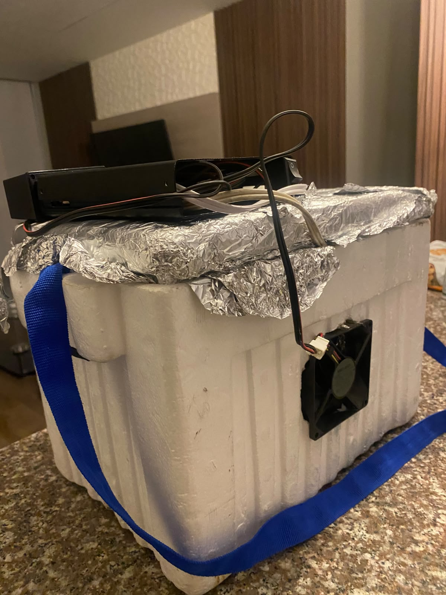
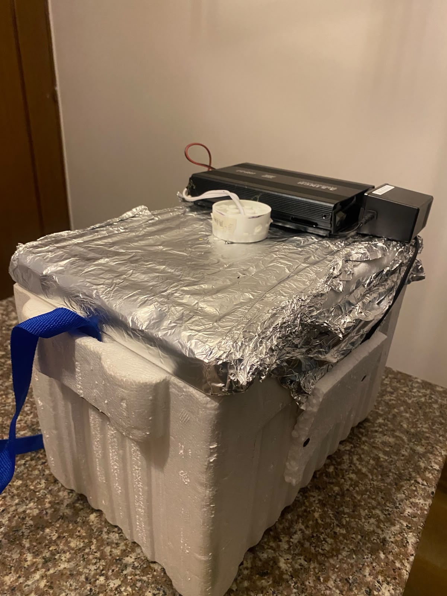
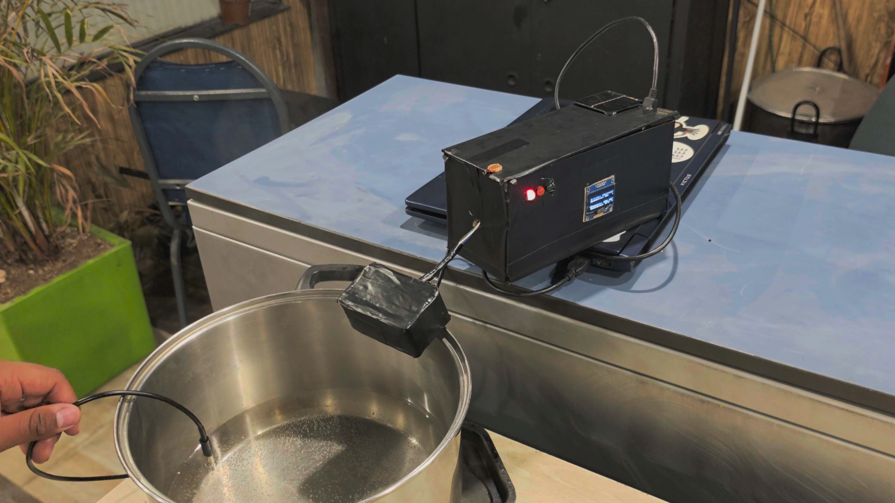
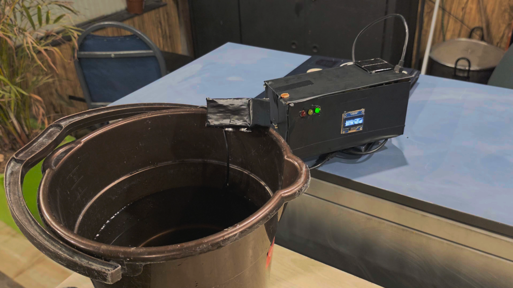
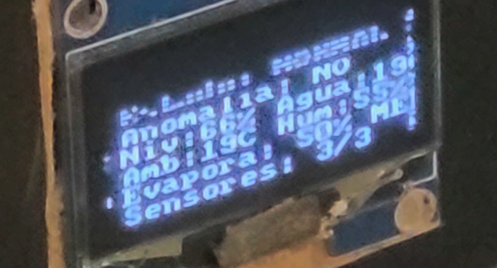
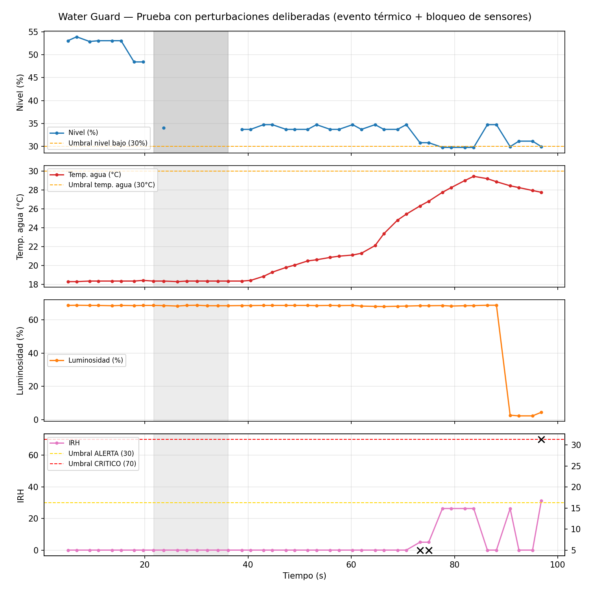

# 💧 WaterGuard v8
Sistema IoT de monitoreo de disponibilidad y escasez de agua en puntos críticos de almacenamiento, pensado para la región Sabana Centro (Cundinamarca) frente al Fenómeno de El Niño. Basado en **ESP32**, combina nivel de agua (con redundancia ultrasónica e hidrostática), temperatura, humedad, radiación y presión para calcular un **Índice de Riesgo Hídrico (IRH)** y un **índice de evaporación potencial** en tiempo real. Detecta anomalías y reglas de fusión multisensor, y alerta de dos formas: **in situ** (LEDs, buzzer, pantalla OLED y botón físico) y en un **tablero de control web embebido**, accesible solo desde la WLAN de la zona.

**Universidad de La Sabana** — Facultad de Ingeniería, Ingeniería Informática
**Curso:** IoT (Internet of Things) — 2026-2
**Integrantes:** Juan José Riaño Zabaleta · Santiago Peña Beltrán

> 📖 **¿Quieres profundizar?** La documentación completa —restricciones de diseño, arquitectura, diagramas UML, esquemáticos, estándares aplicados, modelo de negocio, protocolo de pruebas, declaración de uso de IA y el análisis offline con K-Means— está en la **[Wiki del repositorio](../../wiki)**.

---

## 🔄 De la v7 a la v8 (Challenge #2)

La v7 (primer corte) funcionaba en un Arduino Uno R3 y solo alertaba localmente. El segundo corte exige que las autoridades puedan vigilar el punto de monitoreo desde un navegador, dentro de la WLAN de la Alcaldía, sin MQTT y con la medición fuera del hilo principal. Esto obligó a migrar a ESP32 y a rediseñar el firmware.

| Aspecto | v7 (primer corte) | v8 (segundo corte) |
|---|---|---|
| Placa | Arduino Uno R3 | ESP32 DevKit V1 (WROOM-32, 30 pines) |
| Alertas | Solo in situ | In situ + tablero web en la WLAN |
| Medición | En el `loop()` | ISR + tareas FreeRTOS (el `loop()` solo atiende la web) |
| Nivel de agua | Solo HC-SR04 | HC-SR04 + MD-PS002 (presión hidrostática), fusionados |
| Evaporación | Índice heurístico por pesos | Índice basado en la ley de Dalton (déficit de presión de vapor) |
| Presión atmosférica | No se medía | BMP280 (opcional, detección automática) |
| Seguridad | No aplicaba | Filtro de subred + login con hash SHA-256 + sesión atada a IP |
| Silenciar alarma | No existía | Desde el tablero o con botón físico |

---

## 🧩 Metodología de desarrollo

### 1. Análisis del problema y del entorno
El punto de partida fue entender el entorno real a monitorear: un tanque de agua expuesto a condiciones ambientales variables. Se identificaron los factores que inciden sobre el riesgo hídrico y la evaporación: **agua** (nivel y temperatura), **calor** (temperatura ambiente y del líquido), **caudal y viento** (movimiento de aire que acelera la evaporación), **refrigeración** (condiciones que la reducen) y la **acumulación** de estos efectos en el tiempo. En el segundo corte se sumó la necesidad de que las autoridades locales vigilen esas variables de forma remota dentro de la red de la zona.

### 2. Diseño del ambiente de pruebas
Se construyó un banco de pruebas capaz de simular ese ecosistema de forma controlada, usando una **nevera de icopor** como cámara cerrada:
- **Aluminio** en las paredes internas, para concentrar y conducir el calor de forma uniforme.
- Un **bombillo halógeno**, como fuente de calor controlada.
- **Ventiladores**, para generar caudal de aire y simular viento dentro de la cámara.

<p align="center">
  
  
</p>
<p align="center">
  
  
</p>
<p align="center"><em>Banco de pruebas — nevera de icopor forrada en aluminio para concentrar el calor, con bombillo halógeno como fuente de calor controlada y ventilador lateral para generar caudal de aire.</em></p>

### 3. Selección de sensores y migración a ESP32
La elección respondió a un balance entre **cobertura de las variables**, **costo** y **escalabilidad**. Para la v8 se migró a ESP32 porque integra WiFi (necesario para el servidor web embebido), tiene dos núcleos para separar medición y red, y cuesta menos que un Arduino con módulo WiFi externo. Se retiró el KY-018 (su dato digital de "hay luz" se deriva ahora de la fotoresistencia) y se incorporó el MD-PS002 como segunda fuente de nivel.

### 4. Conexión y validación del circuito
Cada sensor se conectó y probó de forma individual antes de integrarlos en un mismo circuito y firmware. En la migración a ESP32 se adaptó el cableado a la lógica de 3.3 V (divisor de voltaje en el ECHO del HC-SR04, pull-ups a 3.3 V) y se evitaron los pines de arranque y el ADC2, que no funciona con WiFi activo.

<p align="center">
  
  
</p>
<p align="center"><em>Figuras 1 y 2 — Montaje del primer corte (Arduino, pantalla OLED, LEDs indicadores y sensores) sobre los recipientes usados para simular el tanque de agua.</em></p>

<p align="center">
  
</p>
<p align="center"><em>Figura 3 — Pantalla OLED reportando en vivo el estado del sistema durante una corrida de prueba del primer corte.</em></p>

<!-- Agregar aquí fotos del montaje v8 en ESP32 y capturas del tablero de control -->

### 5. Desarrollo del firmware asistido por IA
La lógica de control se desarrolló mediante sesiones de **pair-programming con IA**, iterando sobre el código hasta ajustarlo a los requerimientos del reto y a los umbrales validados con datos del banco de pruebas. La declaración de uso de IA exigida por el curso (herramientas consultadas, instrucciones enviadas y cómo se validaron las respuestas) está en la **[Wiki](../../wiki)**.

<p align="center">
  
</p>
<p align="center"><em>Figura 4 — Análisis offline de una corrida de prueba con perturbaciones deliberadas (evento térmico y bloqueo de sensores), usada para validar y ajustar los umbrales de alerta/crítico del IRH.</em></p>

---

## 🚀 ¿Qué hace?
- Mide el **nivel de agua** con dos principios físicos distintos: ultrasonido desde arriba (HC-SR04) y presión hidrostática desde el fondo (MD-PS002). Si coinciden se promedian; si discrepan se usa el menor (criterio conservador para sequía) y se notifica; si uno falla, el otro mantiene el sistema operando.
- Calcula la **tasa de descenso del nivel** (%/min) por regresión lineal sobre el último minuto.
- Mide la **temperatura del agua** (DS18B20), **temperatura y humedad ambiente** (DHT11), **radiación** como proxy de luminosidad (fotoresistencia) y **presión atmosférica** (BMP280, opcional).
- Calcula un **índice de evaporación potencial** (0-100) basado en la ley de Dalton.
- Calcula el **IRH (Índice de Riesgo Hídrico)** de 0 a 100 fusionando todas las señales, con reglas compuestas como *descenso anómalo del nivel bajo calor extremo*.
- Detecta **anomalías** con media y desviación estándar sobre una ventana móvil.
- Clasifica el sistema en 5 estados: `NORMAL`, `ALERTA`, `CRITICO`, `DEGRADADO` y `ERROR`.
- Alerta **in situ** con LEDs, buzzer y OLED, aunque se caiga el WiFi.
- Publica un **tablero de control web** con valores actuales, histórico de 15 minutos, notificaciones y control de la alarma.
- Imprime por Serial una línea `LOG,...` en CSV lista para análisis offline en Python.

---

## 🧠 Arquitectura del firmware

La medición nunca pasa por el hilo principal. WiFi y la pila TCP corren en el núcleo 0; medición y lógica en el núcleo 1.

| Componente | Tipo | Núcleo / prioridad | Responsabilidad |
|---|---|---|---|
| `isrEcho` | ISR | — | Mide el ancho del pulso del HC-SR04 y despierta a `tSensores` |
| `isrBoton` | ISR | — | Botón físico de silencio con antirrebote |
| `tSensores` | Tarea FreeRTOS | 1 / 3 | Lee todos los sensores y fusiona las dos fuentes de nivel |
| `tAnalitica` | Tarea FreeRTOS | 1 / 2 | Evaporación, IRH, anomalías, estados, eventos e histórico |
| `tSalidas` | Tarea FreeRTOS | 1 / 1 | LEDs, buzzer y OLED |
| `loop()` | Hilo principal | 1 | Solo servidor web y reconexión WiFi |

Los datos compartidos se protegen con un mutex, y el bus I2C (compartido por OLED y BMP280) tiene su propio mutex.

---

## 🌐 Tablero de control

Servidor HTTP embebido en el ESP32, **sin MQTT** y **sin dependencias externas**. No carga nada de internet, porque la WLAN de la zona puede no tener salida: las gráficas se dibujan en `<canvas>`. Funciona en PC y celular.

- Estado del sistema con código de color y motivo (reglas activas, anomalías, discrepancia de nivel).
- Tanque animado con el nivel fusionado y el detalle de cada fuente.
- Variables en tiempo real (actualización cada 2 s) e histórico de 15 minutos por variable.
- Notificaciones de cambios de estado, fallas de sensores, accesos y acciones sobre la alarma, con sonido y vibración opcionales.
- Botón para silenciar o reactivar la alarma física.

### 🔒 Acceso restringido (3 capas)
1. **WPA2** de la WLAN, a cargo de la Alcaldía.
2. **Filtro de subred:** se rechaza cualquier IP fuera de la red local, y cada rechazo queda registrado. Hay una lista blanca opcional de IPs para usar con reservas DHCP.
3. **Login:** la clave se almacena como hash SHA-256 y se compara en tiempo constante. La sesión usa un token aleatorio de 128 bits en una cookie `HttpOnly` atada a la IP del cliente, con expiración de 30 minutos. Tras 5 intentos fallidos, la IP se bloquea 2 minutos.

---

## 🔌 Hardware y pines (ESP32 DevKit V1)

En la placa, el número después de la "D" es el número de GPIO. Los GPIO 16 y 17 están rotulados **RX2** y **TX2**.

| Componente | Pin | Función |
|---|---|---|
| OLED SSD1306 (SDA / SCK) | D21 / D22 | Pantalla de estado (I2C) |
| BMP280 (SDA / SCL), opcional | D21 / D22 | Presión atmosférica (mismo bus I2C) |
| HC-SR04 (Trig / Echo) | D25 / D26 | Nivel por ultrasonido. ECHO con divisor 1 kΩ / 2 kΩ |
| MD-PS002 vía HX711 o HX710B (DT / SCK) | D32 / D33 | Nivel por presión hidrostática |
| DHT11 | D4 | Temperatura y humedad ambiente |
| DS18B20 | D27 | Temperatura del agua. Pull-up de 4.7 kΩ a 3.3 V |
| Fotoresistencia | D34 | Radiación / luminosidad (ADC1) |
| LED verde / amarillo / rojo | RX2 (16) / TX2 (17) / D19 | Estado del sistema (220 Ω en serie) |
| Buzzer | D23 | Alarma sonora (conexión directa) |
| Botón | D18 | Silenciar alarma in situ (a GND, pull-up interno) |

⚠️ Los sensores se alimentan a **3.3 V**; solo el HC-SR04 va a VIN (5 V). No se usan los pines 0, 2, 12 y 15 (arranque) ni el ADC2.

> El MD-PS002 es un puente de Wheatstone que entrega milivoltios, así que requiere una etapa de amplificación (HX711 o HX710B) para ser leído por el ESP32. Si no está conectado, el firmware lo detecta y el nivel se mide solo con el HC-SR04.

---

## 🚦 Estados del sistema
| Estado | LEDs | Buzzer |
|---|---|---|
| 🟢 **NORMAL** — todo en orden | Verde | Apagado |
| 🟡 **ALERTA** — el IRH supera el umbral de alerta | Amarillo | Apagado |
| 🔴 **CRITICO** — IRH alto sostenido 5 s, con histéresis para salir | Rojo | Encendido |
| 🟠 **DEGRADADO** — faltan sensores confiables para confirmar | Amarillo intermitente | Apagado |
| ⚠️ **ERROR** — ningún sensor de datos responde | Rojo intermitente | Intermitente |

La alarma silenciada se rearma sola al salir de `CRITICO`/`ERROR` o a los 10 minutos.

---

## 📊 Índices calculados

### Evaporación potencial (0-100)
Basado en la **ley de Dalton**: la evaporación es proporcional a la diferencia entre la presión de vapor en la superficie del agua y la del aire. Las presiones se calculan con la ecuación de Tetens. Es un índice relativo, no una tasa en mm/día.

| Variable | Peso |
|---|---|
| Déficit de presión de vapor (temp. agua, temp. ambiente y humedad) | 45 |
| Radiación (luminosidad) | 30 |
| Temperatura ambiente | 15 |
| Presión atmosférica | 10 |

Categorías: **BAJA** (<30), **MEDIA** (30-60), **ALTA** (≥60).

### IRH — Índice de Riesgo Hídrico (0-100)
| Variable | Peso |
|---|---|
| Nivel de agua | 40 |
| Tasa de descenso | 20 |
| Evaporación | 15 |
| Humedad baja | 15 |
| Temperatura del agua | 10 |

**Reglas de fusión:**
- **R1:** descenso anómalo del nivel + calor extremo → +20.
- **R2:** nivel bajo (<30 %) + evaporación ALTA → +10.

Cada anomalía estadística activa suma 5 puntos (máximo 4). Los índices se normalizan solo sobre los sensores disponibles, de modo que la falla de uno no invalida el cálculo.

> Los umbrales de descenso (1 y 3 %/min) están escalados para que el prototipo muestre los eventos en minutos. En campo se calibran según la dinámica real del reservorio.

---

## 🛠️ Librerías necesarias
Desde el Gestor de Librerías del Arduino IDE:
- `U8g2`
- `DHT sensor library` (Adafruit) y `Adafruit Unified Sensor`
- `Adafruit BMP280 Library`
- `OneWire`
- `DallasTemperature`

`WiFi`, `WebServer`, `ESPmDNS` y `Wire` vienen incluidas con el núcleo ESP32. Probado con los núcleos ESP32 2.0.x y 3.x.

## ▶️ Uso
1. Conecta los componentes según la tabla de pines.
2. En [WaterGuard_v8.ino](WaterGuard_v8.ino), configura `WIFI_SSID` y `WIFI_PASS` con la red de la zona (debe ser de **2.4 GHz**), y define las credenciales del tablero (`USUARIO_TABLERO` y el hash SHA-256 de la clave en `HASH_CLAVE_TABLERO`). Para generar el hash:
   ```bash
   python -c "import hashlib;print(hashlib.sha256(b'TU_CLAVE').hexdigest())"
   ```
3. En el Arduino IDE, selecciona la placa **DOIT ESP32 DEVKIT V1** y el puerto correspondiente, y sube el código con **Subir** (no con Depurar). Si se queda en "Connecting...", mantén presionado **BOOT**.
4. Si usas el MD-PS002, enciende con la manguera **fuera del agua**: los primeros segundos se toman como referencia de 0 cm. Luego lleva la punta al fondo del tanque.
5. Abre el Monitor Serial a **115200 baudios**. Ahí verás los sensores detectados, el escaneo I2C y la IP del tablero, que también aparece en la segunda página de la OLED.
6. Desde un dispositivo conectado a la misma red, abre `http://<IP del ESP32>` (o `http://waterguard.local`) e inicia sesión.

### Calibración del sensor de presión
La sensibilidad varía entre módulos. Anota el valor `HX crudo` del Serial con la manguera en el aire y luego sumergida a una profundidad conocida *H* (cm), y ajusta:

```
HX_CUENTAS_POR_KPA = (crudo_sumergido − crudo_aire) / (H × 0.0980665)
```

---

## 📚 Más información
Este README es un resumen. El diseño completo, las justificaciones de cada umbral, los diagramas, el protocolo de pruebas con sus resultados y la declaración de uso de IA están en la **[Wiki de este repositorio](../../wiki)**. La versión del primer corte se conserva en [WaterGuard_v7.ino](WaterGuard_v7.ino).